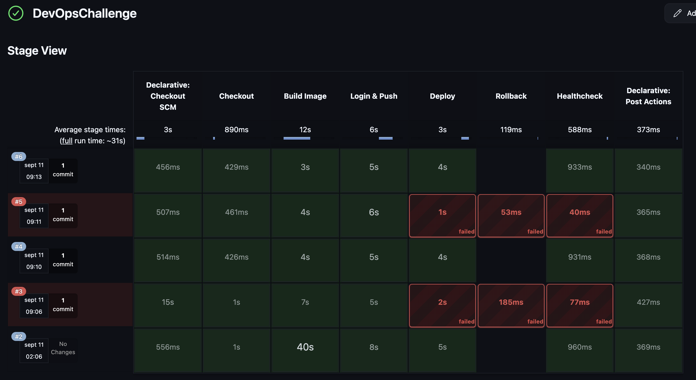

# Laravel Hello World API

A simple Laravel application that provides a REST API endpoint to return a "Hello World" JSON response.

## Features

- Simple REST API endpoint
- JSON response format
- Laravel 11 framework
- Ready-to-use development server

## Requirements

- PHP >= 8.2
- Composer
- Laravel 11

## Installation

1. Clone the repository:

```bash
git clone <repository-url>
cd laravel-starter
```

2. Install dependencies:

```bash
composer install
```

1. Copy environment file:

```bash
cp .env.example .env
```

1. Generate application key:

```bash
php artisan key:generate
```

## Usage

### Start the Development Server

```bash
php artisan serve
```

The application will be available at `http://127.0.0.1:8000`

### API Endpoint

**GET** `/api/hello`

Returns a JSON response with a hello world message.

#### Example Request

```bash
curl -X GET http://127.0.0.1:8000/api/hello
```

#### Example Response

```json
{
  "message": "Hello World!",
  "status": "success",
  "timestamp": "2025-01-09T11:48:07.215051Z"
}
```

### Testing with Different Tools

#### Using curl

```bash
curl -X GET http://127.0.0.1:8000/api/hello
```

#### Using wget

```bash
wget -qO- http://127.0.0.1:8000/api/hello
```

#### Using HTTPie

```bash
http GET http://127.0.0.1:8000/api/hello
```

## Project Structure

- `app/Http/Controllers/HelloController.php` - Controller handling the hello endpoint
- `routes/api.php` - API routes definition
- `bootstrap/app.php` - Application bootstrap configuration

## License

This project is open-sourced software licensed under the [MIT license](https://opensource.org/licenses/MIT).

## DevOps Challenge — Deploy Laravel Hello World to DigitalOcean with Jenkins

### 1. Goal

Ship a Laravel 11 Hello World API to production as a single Docker container on a DigitalOcean Droplet using a Jenkins CI/CD pipeline.

- No database, no Docker Compose, no Kubernetes.
- The app must run securely in production as a non-root container.
- Secrets must be injected via Jenkins credentials.

### 2. Application Summary

- Endpoint: GET /api/hello
- Response: JSON payload with message, status, and timestamp.
- Stack: PHP 8.2+, Laravel 12, Nginx, PHP-FPM

### 3. Constraints

- Single container only.
- No database or sidecars.
- No secrets committed to Git.
- Run as non-root.

### 4. Architecture

#### Workflow Overview

1. Code is stored in GitHub.
2. Jenkins checks out code, builds Docker image.
3. Image is tagged with both :git-sha and :latest.
4. Image is pushed to DigitalOcean Container Registry (DOCR).
5. Jenkins connects via SSH to the Laravel Droplet.
6. Droplet pulls the new image, replaces the running container.
7. Container runs Laravel, served via Nginx on port 80.

`GitHub Repo  →  Jenkins Build Agent  →  DOCR (Registry)  →  Droplet (Docker run)`

Here an image of the Build History in Jenkins:



### 5. Environment

- **Droplets (Jenkins and Laravel):** Ubuntu 24.04 LTS with Docker & UFW configured.
- **Registry:** DigitalOcean Container Registry (DOCR) was used for the challenge.
- **Jenkins:**
  - **Master** and **Agent** are configured in the droplet.
  - Credentials configured on **master**:
    - `docr-token` → DOCR token
    - `do-ssh-key` → SSH private key for Droplet access
    - `laravel-app-key` → Laravel APP_KEY
  - **Agent** has Docker CLI installed.

### 6. Implementation

A. Containerization

### Jenkins Setup

To support CI/CD, Jenkins was containerized and deployed in the same droplet.  
Both **master** and **agent** run as Docker containers, with persistent volumes and a `Makefile` to simplify management.

#### Architecture

- **Droplets (Jenkins and Laravel):** Ubuntu 24.04 LTS with Docker & UFW configured.  
- **Registry:** DigitalOcean Container Registry (DOCR).  
- **Jenkins Master:**
  - Runs in a Docker container on the droplet (started via `master.sh`).  
  - Stores persistent data in `jenkins_home/`.  
  - Configured with credentials:
    - `docr-token` → DOCR token  
    - `do-ssh-key` → SSH private key for droplet access  
    - `laravel-app-key` → Laravel APP_KEY  
- **Jenkins Agent:**
  - Runs in a separate container built from a custom **Dockerfile**.  
  - Has Docker CLI installed and is connected to the host Docker socket (`/var/run/docker.sock`) to build and push images.  
  - Registered with the master using JNLP.  
- **Makefile** is used to build, start, stop, and restart both master and agent containers.

### Accessing Jenkins

Jenkins is running on the dedicated Jenkins Droplet.

- **URL:** `http://<jenkins-droplet-ip>:8080`
- **Credentials:** Provided separately in the challenge handoff (not stored in the repository).

> 🔒 Note: Jenkins is exposed directly on port **8080** of the droplet.  
> For production environments, it is recommended to run Jenkins behind a reverse proxy (e.g., Nginx) with SSL termination on port 80/443 for better security.

### Laravel Endpoint

- **Multi-stage Dockerfile:**
  - **Builder stage:** installs Composer deps, caches vendor.
  - **Runtime stage:** installs PHP-FPM + Nginx, runs as non-root user **(appuser)**.
- Nginx serves Laravel from `/var/www/html/public`
- Healthcheck defined: curl -f <http://localhost/api/hello>
- Exposes port 80

B. Jenkins Pipeline

Stages:

1. **Checkout** → pull code from Git.
2. **Build** Image → tag with ${GIT_SHA} and latest.
3. **Login & Push** → authenticate and push image to DOCR registry.
4. **Deploy** → SSH into Laravel Droplet, pull image, stop & remove old container, run new container.
5. **Healthcheck** → check /api/hello returns 200.

Deploy command:

```bash
docker run -d --name hello -p 80:80 \
            -e APP_ENV=production \
            -e APP_KEY="$APP_KEY" \
            -e LOG_CHANNEL=stderr \
            -e BUILD_SHA="$GIT_SHA" \
            -e BUILD_AT="$(date +%FT%T%z)" \
            --restart unless-stopped \
            "${REGISTRY}/${IMAGE_NAME}:${GIT_SHA}"
```

C. Healthcheck

The container has a Docker HEALTHCHECK that calls GET /api/hello.

- You can verify health with:

```bash
docker ps --filter "name=hello" --format "table {{.Names}}\t{{.Status}}"
```

D. Logging

- Nginx access/error logs are redirected to stdout/stderr.
- Laravel logs are redirected to stderr (LOG_CHANNEL=stderr).
- You can see all logs with:

```bash
docker logs -f hello
```

E. Rollback

- Pipeline accepts a parameter ROLLBACK_SHA.
- If supplied, pipeline skips build/push and redeploys the specified image SHA.
- Healthcheck stage always runs after rollback.

### 7. Security Hardening

- Container runs as non-root user (appuser).
- APP_KEY and other secrets are injected via Jenkins credentials, never stored in Git.
- Droplet secured with:
  - SSH key authentication only, root login and password authentication are disabled.
  - UFW firewall open only for ports 22, 80, 443, and 50000 on Jenkins droplet.
  - Docker containers runs with --restart unless-stopped for resilience.

### 8. Deploy & Rollback Instructions

#### Deploy (standard run)

1. Push code changes to GitHub.
2. Jenkins pipeline triggers automatically (or manually).
3. Pipeline builds, pushes, and deploys the new image.
4. Validate via:

```bash
curl http://<DROPLET_IP>/api/hello
```

#### Rollback (manual run)

1. Re-run Jenkins pipeline.
2. Supply parameter ROLLBACK_SHA=<previous_git_sha>.
3. Pipeline skips build and redeploys the given image.
4. Verify with healthcheck and logs.

### 9. Jenkins Operational Tooling (Makefile)

To simplify management, a Makefile is provided.

#### Jenkins Master & Agent

- **build**  
  Builds the Jenkins agent Docker image using the current directory’s Dockerfile.

  **Usage:** `make build`

- **start-master**  
  Starts the Jenkins master by running the master.sh script.

  **Usage:** `make start-master`

- **start-agent**  
  Builds the agent image (if needed) and starts the Jenkins agent by running the agent.sh script.

  **Usage:** `make start-agent`

- **start**  
  Starts both Jenkins master and agent in sequence.

  **Usage:** `make start`

- **stop**  
  Stops and removes both Jenkins master and agent containers if they are running.

  **Usage:** `make stop`

- **restart**  
  Stops and then starts both Jenkins master and agent containers.

  **Usage:** `make restart`

- **logs**  
  Tails the logs for both Jenkins master and agent containers for real-time monitoring.

  **Usage:** `make logs`

- **clean**  
  Stops containers and removes the Jenkins agent Docker image to free up space.

  **Usage:** `make clean`

### 10.  Acceptance Criteria

- Docker image builds successfully locally and in Jenkins.
- Running container responds to GET /api/hello with 200 JSON.
- Jenkins pipeline builds, pushes, and deploys automatically.
- Container runs as non-root and survives droplet reboots.
- README clearly documents setup, deploy, rollback.

### 11.  Submission

- Repository contains:
  - Dockerfile (Multi-stage, optimized)
  - nginx.conf
  - Jenkinsfile (Declarative pipeline with rollback support)
  - Makefile (Jenkins infra management)
  - README.md (This documentation)
  - [Video explaining the challenge](https://drive.google.com/file/d/1NwyNdaqYxtYzCUm0btCUx62EWiwRCZ-F/view?usp=sharing)
